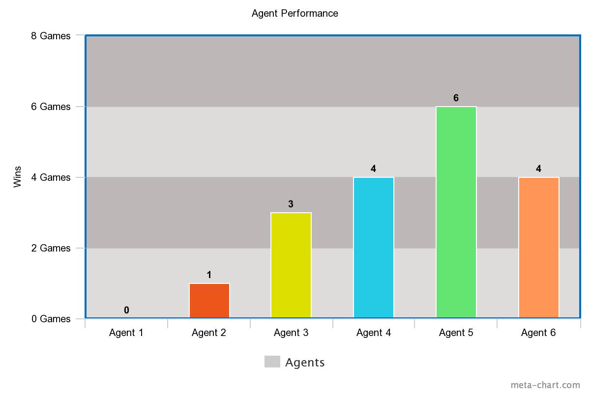

# Chess AI

A chess AI, with with different algorithms of increasing intelligence.

Play live version here: https://bay-chess-ai.herokuapp.com/

See my blog post about implementation here: https://byanofsky.com/2017/07/06/building-a-simple-chess-ai/

Based on [Lauri Hartikka's tutorial](https://medium.freecodecamp.org/simple-chess-ai-step-by-step-1d55a9266977)

## Getting Started

These instructions will get you a copy of the project up and running on your local machine for development. See Deployment for notes on how to deploy the project on a live system.

### Prerequisites

You will need to have Node.js and npm installed. For instructions on installing Node, please visit [NPM's documentation on installing Node.js](https://docs.npmjs.com/getting-started/installing-node).

### Installing

You can run npm's initialization to install dependencies from `package.json`.

```
npm install
```

### How to Play

#### Computer vs Computer

Just run the npm start command to begin testing the agents

```
npm start
```

`skillW` and `skillB` only work with alogs 3 & 4. The skill level is what sets how many moves ahead each player will look.

Algo 3 does not use alpha beta pruning, so setting skill levels greater than 2 will make move times very long.

Algo 4 uses alpha beta pruning, so you can set skill level up to 3, maybe even 4. But beyond that, move times will be very long.

## Results

Agents are as follows:

1. Depth = 1, Evaluation Function = 1
2. Depth = 2, Evaluation Function = 1
3. Depth = 1, Evaluation Function = 2
4. Depth = 2, Evaluation Function = 2
5. Depth = 3, Evaluation Function = 1
6. Depth = 3, Evaluation Function = 2



## Built With

- [Express](https://expressjs.com) - The web framework used
- [chess.js](https://github.com/jhlywa/chess.js) - Chess library
- [chessboard.js](https://github.com/oakmac/chessboardjs) - Chess board visualization

## Authors

- **Brandon Yanofsky** - _Initial work_ - [byanofsky](https://github.com/byanofsky)

## Acknowledgments

- Inspired by [Lauri Hartikka's tutorial](https://medium.freecodecamp.org/simple-chess-ai-step-by-step-1d55a9266977)

## License

This project is licensed under the Apache-2.0 License - see the [LICENSE](LICENSE) file for details. Some files have their own licenses, as described in 3rd Party Software below.

## 3rd Party Software

See [LICENSE-3RD-PARTY](LICENSE-3RD-PARTY) file for full licenses

- [chess.js](https://github.com/jhlywa/chess.js)
  Copyright (c) 2017, Jeff Hlywa (jhlywa@gmail.com)
- [chessboard.js](https://github.com/oakmac/chessboardjs)
  Copyright 2013 Chris Oakman
- [jQuery](https://github.com/jquery/jquery) Copyright JS Foundation and other contributors, https://js.foundation/
